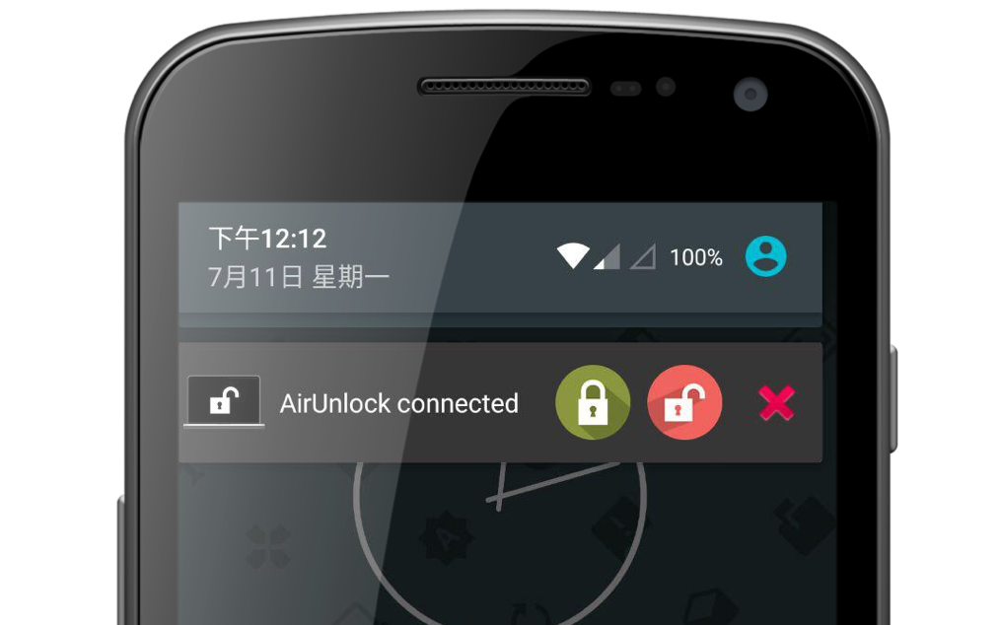
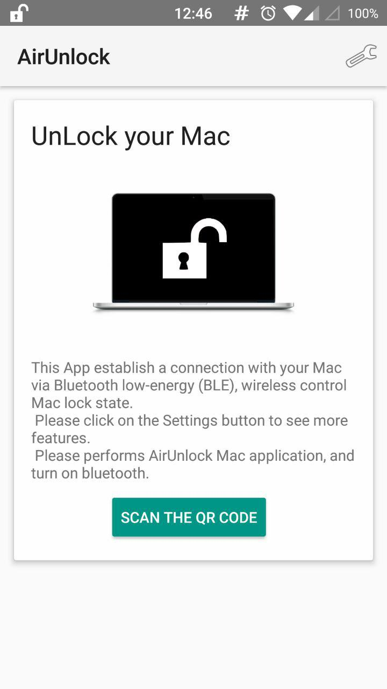
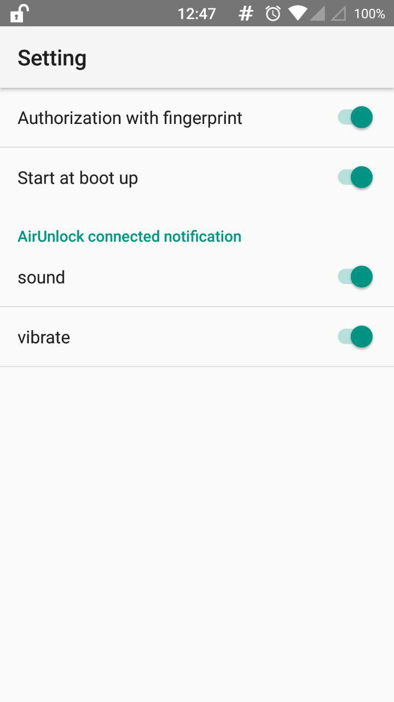
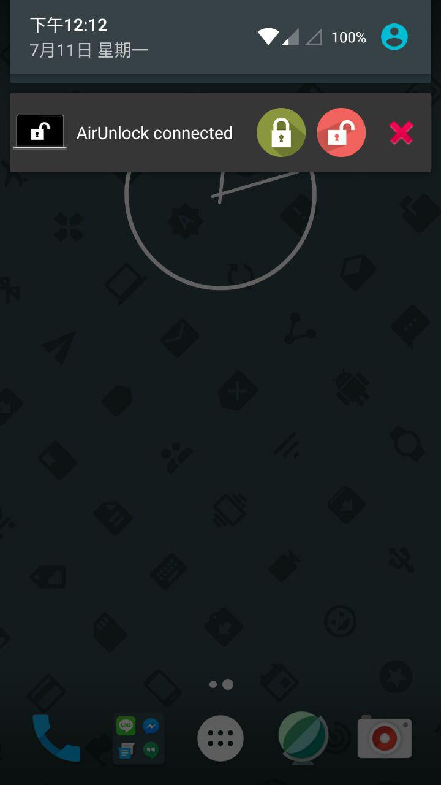
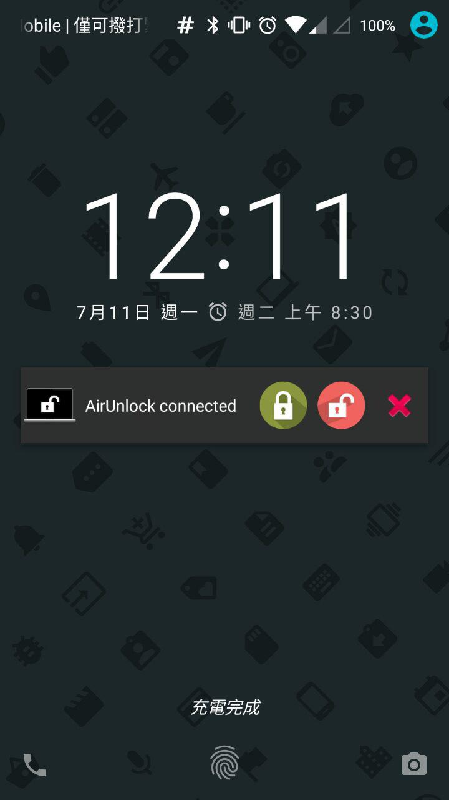

AirUnlock (Android)
===================================
 

Introduction
------------
Using android phone to establish a connection with your Mac via Bluetooth low-energy (BLE), controlling Mac lock state (Lock or Unlock).
#### Features
- Store the password in Mac system keychain.
- Send the UUID for lock/unlock Macbook. (other people can't control your mac)
- Without any internet access.
- Authorization with fingerprint.
- Wake and unlock when mac is sleeping. (can not work when first boot-up and manually lock by clicking your name on the status bar, and then clicking 'Login Window....')
- Unlock when you resume Mac by pressing a key.
- Unlock when you manually lock mac with clicking "lock screen" by keychain access in status bar. [(Choose Keychain Access > Preferences, then click General. Select Show keychain status in menu bar.)](https://support.apple.com/kb/PH20121?viewlocale=en_US&locale=en_US)

Demo
--------------

Requirement
--------------
- Android 5.0+
- Bluetooth 4.0+ both on Mac and Android mobile
- Mac OS X 10.10+ or MacOS 10.12

Getting Started
---------------
- [Download AirUnlock for MacOS.](https://github.com/pinetum/AirUnlock-for-Mac/releases/download/0.4/AirUnlock_mac_0.4.zip) ([or build from source](https://github.com/pinetum/AirUnlock-for-Mac))
- [Download AirUnlock Android client.](https://github.com/pinetum/AirUnlock-for-Android/releases/download/1.0/AirUnlock_v1.0.release.zip) ([or build from source](https://github.com/pinetum/AirUnlock-for-Android))
- Launch AirUnlock on mac and turn on Bluetooth.
- Set up your password.
- Generate a QR-code for android mobile.
- Launch AirUnlock on Android and scan QR-code for first time.
- Control buttons will show in Notification.

Screenshots
-------------
 
 
 
 

Bugs
-------------
- [Some devices will crash when relaunch  Scan QRcode activity.](https://github.com/dm77/barcodescanner/issues/187)

License
-------
Apache

